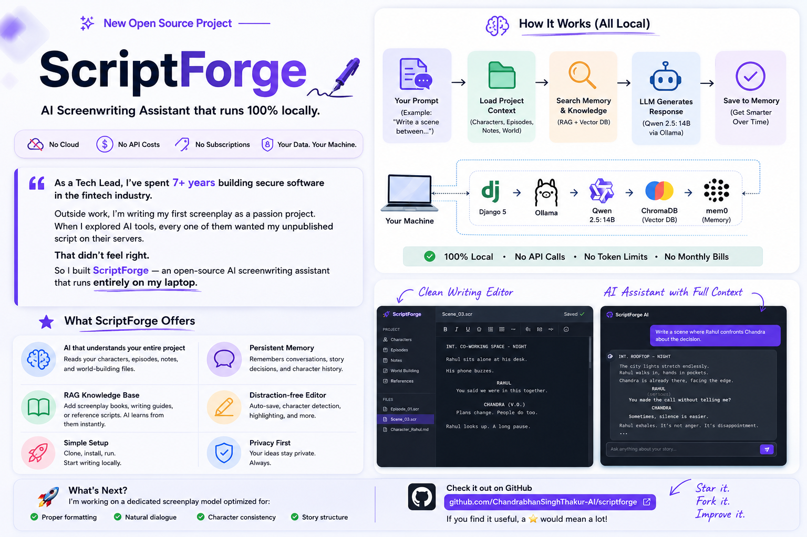

<p align="center">
  
</p>

<p align="center">
  <h1 align="center">✦ ScriptForge</h1>
  <p align="center"><strong>AI-powered screenwriting tool that runs 100% on your computer.</strong></p>
  <p align="center">No cloud. No subscriptions. No data leaving your machine. Ever.</p>
</p>

<p align="center">
  
  
  
  
</p>

---

## 🎯 What is ScriptForge?

ScriptForge is a **local AI writing assistant** built for screenwriters, novelists, and storytellers. It gives you an AI co-writer that:

- Knows your **entire project** (characters, plot, world)
- **Remembers** past conversations and evolves with your story
- Runs **completely offline** — your unpublished work never touches the internet
- Works in a **beautiful distraction-free editor** with highlighting and formatting

```
┌─────────────────────────────────────────────────────────────────────┐
│                         ScriptForge UI                                │
│                                                                       │
│  ┌──────────┐  ┌─────────────────────────────┐  ┌────────────────┐  │
│  │  📁 Files │  │                             │  │  🤖 AI Writer  │  │
│  │           │  │      ✍️  Your Editor         │  │                │  │
│  │ episodes/ │  │                             │  │  "Write a plot │  │
│  │ characters│  │   Write your story here...  │  │   twist for    │  │
│  │ world/    │  │   Auto-saves. Highlights.   │  │   episode 3"   │  │
│  │           │  │   Format controls.          │  │                │  │
│  │           │  │                             │  │  AI: Here's a  │  │
│  │           │  │                             │  │  twist where...│  │
│  └──────────┘  └─────────────────────────────┘  └────────────────┘  │
└─────────────────────────────────────────────────────────────────────┘
```

---

## ✨ Features

| Feature | Description |
|---------|-------------|
| 🤖 AI Co-Writer | Ask AI to write dialogue, scenes, plot twists — in Hinglish or English |
| 🧠 Memory | AI remembers past conversations and your full project context |
| 🎨 Rich Editor | Font controls, text colors, highlighter, auto-save |
| 📁 File Manager | Organize characters, episodes, world-building in folders |
| 👤 Character Panel | Auto-shows relevant character specs while you write |
| 🔒 100% Private | Everything local — no internet, no accounts, no tracking |
| ⚡ Fast | 3-second launch after first setup |

---

## 🚀 Quick Start

### For Non-Technical Users

```
1. Download & unzip this project
2. Double-click "Start ScriptForge.command"
3. Wait 15 min (first time only — downloads AI)
4. Browser opens → start writing!
```

> ☕ First run downloads ~9GB of AI models. After that, it's instant.

### For Developers

```bash
git clone https://github.com/YOUR_USERNAME/scriptforge.git
cd scriptforge
./run.sh
```

---

## 🏗️ Architecture

```
┌─────────────────────────────────────────────────────────────┐
│                        YOUR MACHINE                           │
│                                                               │
│  ┌───────────┐     ┌──────────────┐     ┌───────────────┐   │
│  │  Browser  │◄───►│   Django     │◄───►│   Ollama      │   │
│  │  (UI)     │     │   (Server)   │     │   (Local LLM) │   │
│  └───────────┘     └──────┬───────┘     └───────────────┘   │
│                           │                                   │
│                    ┌──────▼───────┐                           │
│                    │   ChromaDB   │                           │
│                    │  (Memory)    │                           │
│                    └──────────────┘                           │
│                                                               │
│  ┌─────────────────────────────────────────────────────────┐ │
│  │  manuscripts/                                            │ │
│  │  ├── characters/  ← Your character profiles              │ │
│  │  ├── episodes/    ← Your scripts                         │ │
│  │  └── world-building/ ← Lore, settings, rules            │ │
│  └─────────────────────────────────────────────────────────┘ │
│                                                               │
│              Nothing leaves this box. Ever.                    │
└─────────────────────────────────────────────────────────────┘
```

---

## 🧠 How the AI Memory Works

```
 You ask: "Write Chandra's confrontation scene"
         │
         ▼
 ┌─────────────────────────────────────────────────────────┐
 │  1. Load ALL your project files (characters, episodes)  │
 │  2. Search REFERENCES for relevant writing techniques   │
 │  3. Search MEMORY for past conversations                │
 │  4. Combine everything into one smart prompt            │
 │  5. Send to local LLM (qwen2.5:14b via Ollama)         │
 │  6. Stream response back in real-time                   │
 │  7. Save conversation to memory (for next time)         │
 └─────────────────────────────────────────────────────────┘
         │
         ▼
 AI responds with a scene that knows:
 • Who Chandra is (from characters/chandra.md)
 • What happened before (from memory)
 • How to write a proper scene (from references/)
 • The tone of your series (from all files)
```

**The more you write, the smarter it gets.**

---

## 📚 References (RAG — Knowledge Base)

The `references/` folder is your AI's **screenwriting library**. Drop any writing guides, screenplay techniques, or sample scripts here — the AI will use them to give better responses.

### How it works:

```
references/
├── screenplay-format-guide.md       ← How to format scripts
├── story-structure-guide.md         ← Three-act structure, arcs
├── sample-script-corporate-pilot.md ← Example cold open
└── indian-webseries-writing.md      ← Hinglish dialogue patterns

         │ (on first app launch)
         ▼
┌─────────────────────────────────────────────┐
│  Each file is split into chunks (~500 chars) │
│  Each chunk is converted to a vector         │
│  (using nomic-embed-text)                    │
│  Stored in .mem0_db/ (ChromaDB)              │
└─────────────────────────────────────────────┘

         │ (every time you ask AI something)
         ▼
┌─────────────────────────────────────────────┐
│  Your question is embedded → search vectors  │
│  Top 5 most relevant chunks are retrieved    │
│  Added to AI prompt as expert knowledge      │
└─────────────────────────────────────────────┘
```

### Adding your own references:

**From the app (recommended):**
1. Click **📚 Refs** tab in the right panel
2. Click **+ New Reference File** → name it → paste content → **💾 Save**
3. Click **🔄 Re-index** to update AI knowledge

**Or manually:**
1. Put any `.md` or `.txt` file in `references/`
2. Click **🔄 Re-index** in the app (or restart)

**View & edit existing:**
- Click any file in the Refs tab → edit directly → Save

**View all stored data:**
- Click **🧠 Memory** button (bottom bar) → see all conversations + indexed references

**Examples of what to add:**
- Screenplay book notes (your own summaries)
- Dialogue style guides
- Sample scripts you admire
- Genre-specific writing techniques
- Character archetype guides

### Where data is stored:

```
.mem0_db/                          ← Auto-created, DON'T commit this
├── chroma.sqlite3                 ← All vectors + metadata
└── <uuid>/
    ├── data_level0.bin            ← Actual vector embeddings
    ├── header.bin
    ├── length.bin
    └── link_lists.bin

Contains two types of data:
• Past conversations (user_id: "writer") — your chat history with AI
• Reference chunks (user_id: "reference") — knowledge from references/
• Both searchable by semantic similarity (meaning, not exact words)
```

> ⚠️ `.mem0_db/` is in `.gitignore` — personal to each user, auto-builds on first run.

---

## 📁 Project Structure

```
scriptforge/
├── Start ScriptForge.command  ← Double-click to launch (non-tech users)
├── run.sh                     ← Launch script
├── README.md                  ← You're reading this
├── LICENSE                    ← MIT
├── requirements.txt           ← Python dependencies
├── manage.py                  ← Django entry point
├── scriptforge/               ← Django config
│   ├── settings.py
│   └── urls.py
├── writer/                    ← Main app
│   ├── views.py               ← API endpoints + AI logic + RAG
│   ├── urls.py                ← URL routing
│   └── templates/writer/
│       └── index.html         ← Single-page UI (HTML/CSS/JS)
├── references/                ← AI knowledge base (RAG)
│   ├── screenplay-format-guide.md
│   ├── story-structure-guide.md
│   ├── sample-script-corporate-pilot.md
│   └── indian-webseries-writing.md
├── manuscripts/               ← Your writing (auto-created)
│   ├── characters/
│   ├── episodes/
│   └── world-building/
└── .mem0_db/                  ← Vector storage (auto-created, gitignored)
```

---

## 🔧 Tech Stack

| Layer | Technology | Why |
|-------|-----------|-----|
| **Frontend** | Vanilla HTML/CSS/JS | No build step, instant load, zero deps |
| **Backend** | Django 5 | Battle-tested, simple, Python ecosystem |
| **AI Model** | Qwen 2.5:14b (via Ollama) | Best creative writing quality at local scale |
| **Memory** | mem0 + ChromaDB | Persistent vector memory across sessions |
| **Embeddings** | nomic-embed-text | Fast local embeddings for semantic search |

---

## 🎮 Daily Usage

### For Writers (Non-Technical)

1. **Double-click** `Start ScriptForge.command`
2. Browser opens → write
3. Close Terminal window when done

> 💡 Drag `Start ScriptForge.command` to your Dock for one-click launch.

### Editor Controls

| Control | What it does |
|---------|-------------|
| **Size** | Change text size (12-32px) |
| **Font** | JetBrains Mono, Courier, Inter, Georgia |
| **Color** | Pick text color |
| **Line** | Adjust line spacing |
| **🖍️ Mark** | Highlight selected text |
| **✕** | Clear all highlights |

### AI Commands (type in right panel)

```
"Write a scene where Rakesh confronts Chandra"
"Suggest 3 plot twists for episode 2"
"Write this dialogue in aggressive Hinglish"
"Describe the office setting cinematically"
"What are Chandra's motivations?"
```

---

## ⚙️ Configuration

```bash
# Custom manuscripts folder
export SCRIPTFORGE_MANUSCRIPTS=/path/to/your/writing

# Then run
./run.sh
```

---

## ❓ Troubleshooting

| Problem | Solution |
|---------|----------|
| "Python not found" | Install from [python.org/downloads](https://www.python.org/downloads/) |
| "Ollama not found" | Install from [ollama.com](https://ollama.com/download), then re-run |
| App won't start | Make sure Ollama is running (check menu bar icon) |
| AI not responding | First use loads model into RAM (~30 sec). Wait and retry. |
| Browser doesn't open | Go to `http://localhost:8000` manually |
| Want to reset memory | Delete `.mem0_db/` folder and restart |
| Port 8000 in use | Kill other process: `lsof -i :8000` then `kill <PID>` |

---

## 🔒 Privacy & Security

```
┌─────────────────────────────────────────┐
│  Your Machine                            │
│                                          │
│  ✅ Scripts stored locally               │
│  ✅ AI runs locally (no API calls)       │
│  ✅ Memory stored locally (ChromaDB)     │
│  ✅ No accounts or logins                │
│  ✅ No telemetry or tracking             │
│  ✅ Works completely offline             │
│                                          │
│  ❌ Nothing sent to cloud                │
│  ❌ No third-party access                │
│  ❌ No internet required (after setup)   │
└─────────────────────────────────────────┘
```

Your unpublished scripts are **yours alone**.

---

## 💻 System Requirements

| Requirement | Minimum | Recommended |
|------------|---------|-------------|
| **OS** | macOS 12+ / Ubuntu 20+ | macOS 14+ |
| **RAM** | 8 GB | 16 GB |
| **Disk** | 10 GB free | 15 GB free |
| **CPU** | Any 64-bit | Apple Silicon (M1+) |
| **Internet** | Only for first setup | — |

---

## 🤝 Contributing

1. Fork this repo
2. Create a branch: `git checkout -b feature/your-feature`
3. Make changes
4. Submit a Pull Request

Ideas welcome: better UI, more AI models, export to PDF/Final Draft, collaborative writing.

---

## 📜 License

MIT — use it, fork it, make it yours.

---

<p align="center">
  <em>Built by a writer who got tired of paying $20/month for AI tools that send unpublished scripts to the cloud.</em>
</p>
